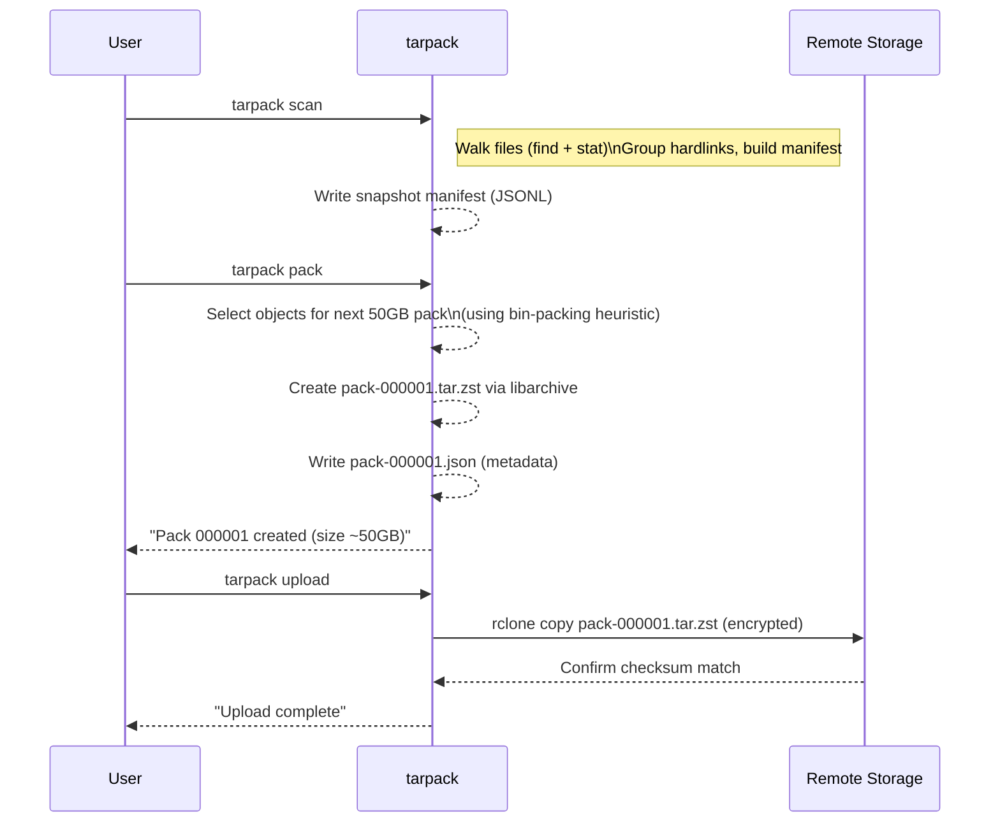
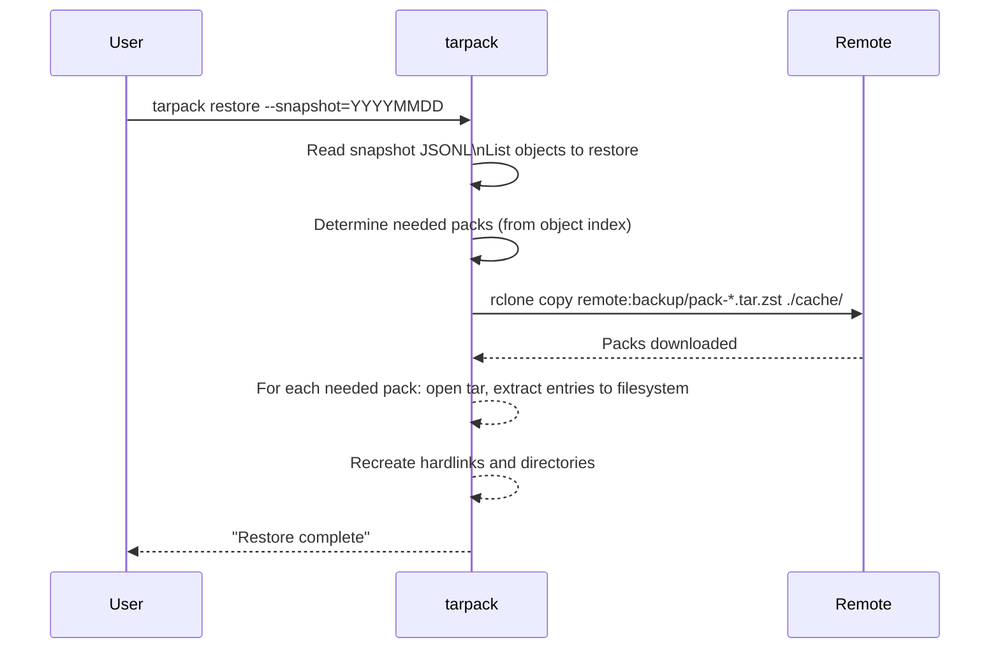

# Executive Summary
We propose **tarpack**, a C11-based backup packer that scans an rsync-style NAS tree, handles hardlinks and deduplication, and packs files into compressed tar archives with accompanying JSON manifests. Our design uses *JSON Lines* format for manifests (one JSON object per line) to enable streaming and incremental updates without rewriting whole files. Each snapshot manifest records file paths, metadata (device, inode, permissions, size, mtime, UID/GID, etc.), and a reference to a content object. Deduplication is achieved by identifying unique objects either via inodes (for hardlinks on the same filesystem) or by strong hashes (e.g. SHA-256) for identical content. Objects are then grouped into ~50 GB packs by a greedy/bin-packing algorithm (an NP-hard problem, so we use heuristics like *First-Fit Decreasing* or a “one-large-file” rule for very large files). Each pack is written as a **tar.zst** stream using libarchive’s API, with relative paths and POSIX “pax” format. A separate JSON *pack manifest* lists the objects in each archive (with pack ID, tar-offset, size, and optional checksum) so that contents can be verified without re-hashing whole archives; because a pack is a single zstd frame, extracting any one object still requires sequentially decompressing the stream up to that point.

For integrity, we record per-object SHA-256 hashes (or blobsum) and a per-pack checksum (e.g. SHA-256 of the tar stream). We also support signing the JSON manifests (via an external GPG or public-key signature) to detect tampering. Uploads to remote storage use [rclone](https://rclone.org/) copying to a configured crypt remote for on-the-fly encryption, and we design around rclone's retry behavior (it re-uploads a whole file if a transfer is aborted, rather than resuming partway through). We emphasize safety: using *openat()* and O_NOFOLLOW to avoid symlink races, compiling with Clang’s sanitizers (AddressSanitizer, UndefinedBehaviorSanitizer, etc.), and careful error checking. Performance is tuned for sequential I/O: we stream file data into libarchive while updating hashes, and we parallelize hashing on multicore CPUs where beneficial (noting that spinning disks can be the bottleneck).

Our implementation plan uses libarchive (for tar+zstd, which pulls in libzstd) as the only system dependency, plus small vendored libraries built directly from source: cJSON (single-file) for JSON parsing/serialization, a public-domain SHA-256 implementation, and uthash (single-header) for mapping objects. The code is built with CMake and strict Clang flags (`-Wall -Wextra -Werror -pedantic -O2`) and sanitizers enabled in debug builds. We provide CLI subcommands (e.g. `tarpack scan`, `tarpack pack`, `tarpack verify`, `tarpack restore`). Testing and CI include unit tests for scanning logic, integration tests on sample trees, and continuous fuzzing of path and stat-handling. The following report covers key design decisions, example schemas, flow diagrams, and code sketches.

## Manifest Schema and On-Disk Layout

**Recommendation:** Use **JSON Lines (JSONL)** for manifest files, with one JSON object per line. This allows **streaming and incremental updates**: new snapshot entries can be appended without rewriting existing data. Each object is self-contained JSON, which Git can diff line-by-line. We version the schema by including a `"format": "tarpack-snapshot-v1"` field in each JSON. Compared to a JSON array (one big document), JSONL avoids loading/parsing the entire file for each change.

We adopt an **object-oriented model** rather than a naïve path listing. Each file content is an *object* identified by either `(device, inode)` or by hash. The **snapshot manifest** (one per backup run) records for each file path:
```jsonc
{ "type": "file",
  "path": "dir/sub/file.txt",
  "device": 64768,
  "inode": 1234567,
  "nlink": 2,
  "uid": 1000,
  "gid": 1000,
  "mode": "0644",
  "size": 987654321,
  "mtime": 1688292012,
  "object_id": "O42",
  "sha256": "ab12cd34...",    // optional if content-hash used
  "first_seen": 1688292010  // monotonic id or timestamp
}
```
Hardlinks are recorded by identical `(device,inode)` pairs. If two paths share the same inode and device, we treat them as the same object. Each unique object gets a generated ID (`"O42"` above). For files where we choose content hashing, we compute SHA-256 and use that (or store it) in the manifest. The manifest may also record a `"source": "local"` field or revision ID if scanning multiple times. (Symlinks, directories, etc. can be recorded with `"type": "symlink"` or `"dir"` entries as needed.)

Alongside snapshots, we maintain an **object index (JSONL)** that records each object’s metadata and physical location. For example:
```jsonc
{ "object_id": "O42",
  "device": 64768, "inode": 1234567,
  "size": 987654321,
  "sha256": "ab12cd34...",
  "pack": "pack-000001",
  "offset": 1024,
  "pack_size": 987654432
}
```
This index is append-only; each line describes an object once (upon first packaging). We update `"first_seen"` or `"packed"` time as needed. All JSON files are stored under a repository root, e.g.:
```
tarpack_repo/
  config.yaml         # (settings like target pack size, etc.)
  snapshots/
    2026-07-09T20-15.jsonl   # JSONL snapshot manifest (one line per file/entry)
  objects/
    objects.jsonl    # running JSONL index of all objects
  packs/
    pack-000001.tar.zst
    pack-000001.json # metadata-only manifest for pack-000001.tar.zst
    pack-000002.tar.zst
    pack-000002.json
  checksums/
    SHA256SUMS      # a file of hashes of the manifests and packs (for audit)
```
For example, a **pack manifest** (`pack-000001.json`) might look like:
```json
{
  "format": "tarpack-pack-v1",
  "pack": "pack-000001",
  "created": 1688292050,
  "entries": [
    { "object_id": "O42",  "path": "dir/sub/file.txt",  "offset": 1024, "size": 987654321, "sha256": "ab12cd34..." },
    { "object_id": "O17",  "path": "dir/other.bin", "offset": 987655345, "size": 1234567,   "sha256": "fe567890..." }
    // ... one per object in this pack
  ]
}
```
Here `"offset"` is the byte offset in the (uncompressed) tar stream where the file data starts. libarchive has no API to query this directly, so tarpack computes it itself with a running counter as it writes each entry: an entry contributes any pax extended-header blocks, then a 512-byte ustar header, then its file data padded up to a 512-byte boundary. Because this layout is fully deterministic, tarpack can record "data starts right after this entry's headers" without any special support from libarchive. `"sha256"` is the object's hash. The `path` is one example path for that object (if multiple hardlinks exist, any one); full path restoration is driven by the snapshot manifest. These offsets are informational — useful for verification and for a future seekable-format variant — but a standard `tar.zst` is a single zstd frame and is not seekable: extracting one file still requires decompressing everything before it, so normal extraction is sequential. We deliberately keep packs as plain single-frame tar.zst so they remain readable by standard `tar --zstd`.

**Schema Comparison:** Below is a brief table contrasting JSON Lines vs JSON arrays for manifest storage:

| Aspect                    | JSON Lines           | JSON Array        |
|---------------------------|----------------------|-------------------|
| **Append/Incremental**    | Append-only (add lines) without rewriting entire file. | Must re-write entire array to add/remove item. |
| **Streaming/Memory**      | Process line-by-line (streaming parser), low memory. | Must parse whole JSON, higher memory for large manifests. |
| **Git Diffability**       | Easy to diff line-by-line (one entry per line). | Any change alters structure/indices, harder diffs. |
| **Tool Support**          | Many libraries exist (e.g. `jsonlines` for Python). | Standard JSON parsers apply; more human-readable array. |
| **Suitability**           | Best for log-like, incremental records. | Best for fixed-size configs or small lists. |

Thus, we recommend JSONL for snapshots and object indices to facilitate efficient appends, streaming reads, and incremental versioning.

## Hardlinks and Deduplication

To **preserve hardlinks**, we treat files with identical `(device,inode)` as a single object. In the snapshot manifest, if two paths have the same device and inode, we assign them the same `object_id`. Packs themselves store each object's content exactly **once** — we do not write tar-level hardlink entries at all. Instead, the snapshot manifest records every path that shares a given object, and on restore we extract the object's data once and recreate the additional names with `link()`. This ensures a one-to-one match with the original hardlink structure while keeping the pack format simple. (Libarchive does support tar hardlink entries via `archive_entry_set_hardlink()` — note `AE_IFLNK` is the *symlink* entry type, not hardlink — but tarpack does not rely on this since dedup at the object layer already avoids storing the content twice.)

Beyond filesystem hardlinks, we implement **content deduplication** by optionally hashing file contents (e.g. SHA-256). If two different inodes (or files on different scans) have the same size and hash, we treat them as the same object. As Oracle notes, “When data deduplication is applied to backups, it identifies duplicate files and blocks, storing only one instance of each unique piece of information”. In practice, if we detect a duplicate (via hash or inode), we store one copy in a pack and make the snapshot refer to that single object. This replaces redundant copies with references: “If a match is found, only one copy of the data is stored, and duplicates are replaced with references to the original”.

We must balance inode-based vs content-based deduplication. Inode-dedup (lightweight) works only on the same filesystem; it has *zero CPU cost* but won’t catch identical files on different drives. Content-hash dedup (heavy) catches cross-filesystem duplicates at the cost of extra I/O/CPU. We support both modes: by default, use inodes for instant hardlink grouping, and optionally compute SHA-256 for any file to find duplicates across paths or scans. (For very large files, hashing can be done in a streaming way to avoid double-reading: see Performance below.)

**Important caveat on `(device, inode)` identity:** this pair is only trustworthy for grouping hardlinks *within a single scan*. It must not be used to decide, across separate runs, whether an object has already been packed. Inode numbers get recycled once files are deleted, and a tree recreated by `rsync` (or restored from another backup) gets entirely fresh inodes even though the content is identical. Cross-run dedup and "already packed" checks therefore have to key on the content hash (in hash mode) or on `(path, size, mtime_ns)` heuristics (in fast mode) — never on raw `(dev,inode)`.

The table below summarizes dedup strategies:

| Strategy                 | Mechanism                                      | Pros                                        | Cons                                      |
|--------------------------|-----------------------------------------------|---------------------------------------------|-------------------------------------------|
| **Inode-based (hardlinks)** | Group by (device, inode) keys. | *Efficient:* no hashing needed; preserves exact hardlink count. | Only detects same-FS links; cannot dedupe across copies or after moving drives. |
| **Content-addressed**     | Compute SHA256 (or other hash) of file contents. | *Robust:* catches identical content anywhere; portable. | Expensive (CPU/IO) for large files; hash collisions negligible but possible. |

Our implementation maintains a hash table (e.g. using **uthash** or similar) keyed by `(dev, inode)` and, optionally, by content hash. As we scan files, we look up or insert entries. For hardlinks (nlink>1), we link them to the first seen path. We store metadata fields (`mode`, `uid`, `gid`, etc.) with the object. All fields to record are:

- **Device & inode:** unique identity on a filesystem.
- **Link count (nlink):** to know if multiple names exist.
- **Size, mode, UID, GID, mtime:** POSIX file metadata.
- **SHA-256 (optional):** for extra integrity and dedup detection.
- **First-seen ID or timestamp:** order index for ordering within manifest.
- **Pack ID & offset:** where the object lives in an archive.

Together these allow a **deterministic restore**: given the manifests, one can reconstruct every file’s data and metadata exactly.

## Packing Algorithms

Packing files into ~50 GB archives is a **bin-packing** problem (NP-hard). We consider heuristics:

- **Greedy (First-Fit):** Sort objects by size descending, then pack each into the first pack with enough space. This is simple and often effective (First-Fit Decreasing is a classic heuristic).
- **Bin-Packing (FFD):** More formally, *First-Fit Decreasing (FFD)* guarantees a solution using at most `11/9·OPT + 6/9` bins — asymptotically about 22% more bins than optimal. We implement something like: sort sizes descending, place each in existing pack or a new pack if needed. Note that sorting by size destroys directory locality (files from the same directory end up scattered across packs), so tarpack's default algorithm is instead **path-ordered next-fit**: walk objects in path order, filling the current pack until the target would be exceeded, then start a new pack. FFD is offered as an optional mode for users who prioritize pack-fill efficiency over locality.
- **Single-Large-File Rule:** If one file exceeds the pack target (50 GB), we put it alone in its own pack to avoid overflows.
- **Packing Table:** We may pre-calculate object sizes and use a simple algorithm to fill packs.

A comparison of approaches:

| Algorithm             | Description                                | Pros                          | Cons                         |
|-----------------------|--------------------------------------------|-------------------------------|------------------------------|
| **Greedy (Next-Fit)** | Fill current pack until exceeding, then new pack. | Very simple.                 | Can be suboptimal (wastes space). |
| **First-Fit Decreasing (FFD)** | Sort by size (largest first), then pack into first bin with room. | Good approximation (≤11/9·OPT + 6/9, i.e. ~22% above optimal); usually high utilization. Plain First-Fit (no sorting) has a looser ≤1.7× OPT bound. | Requires sorting (O(n log n)) and multiple pack tracking; somewhat more complex. |
| **Single-Large Rule** | Files >50 GB go into own pack.             | Avoids overflow; handles huge files. | That pack may be underfilled. |
| **Integer Knapsack Solver** | Solve optimally for each pack (unlikely practical for large N). | Finds optimal fill.         | NP-hard; impractical for thousands of files. |

In practice, FFD or a variant (like *best-fit*) works well. Our code can allow either mode (configurable). We always ensure no pack exceeds the target; we may slightly underfill to keep within limits.

**Tar Layout:** Within each pack archive, we order files arbitrarily or by path; we do not rely on ordering for correctness. (One could pack files from the same directory together for locality, but not strictly necessary.) We use *relative paths* (no leading slash) so that extraction is location-independent. We set libarchive to **pax** format to allow large files and long names. We avoid storing unnecessary metadata (e.g. avoid extended attributes unless desired).

## Archive Creation (libarchive)

We use libarchive’s write API to create `.tar.zst` archives in streaming mode. For each pack:

1. **Initialize Archive:**
   ```c
   struct archive *a = archive_write_new();
   archive_write_add_filter_zstd(a);        // compress with Zstandard
   archive_write_set_format_pax_restricted(a); // pax format (USTAR-like)
   archive_write_open_filename(a, "pack-000001.tar.zst");
   ```
   This sets up zstd compression (level configurable via options) and Pax format. (We can also set options like compression level or LZ window via `archive_write_set_options`.)

2. **Write Entries:** For each object in the pack:
   ```c
   struct archive_entry *entry = archive_entry_new();
   archive_entry_set_pathname(entry, relative_path);
   archive_entry_copy_stat(entry, &st); // copy stat struct (mode, size, uid/gid, times)
   if (is_hardlink) {
       archive_entry_set_hardlink(entry, link_target_path);
   }
   archive_write_header(a, entry);
   if (st.st_size > 0) {
       int fd = open(file_path, O_RDONLY);
       while ((len = read(fd, buf, sizeof(buf))) > 0) {
           archive_write_data(a, buf, len);
           // optionally update SHA256 here on the fly
       }
       close(fd);
   }
   archive_entry_free(entry);
   ```
   This pattern (from an example) is standard. We read the file in chunks and call `archive_write_data()`. Simultaneously, we can update a SHA-256 context to record the object’s checksum in the pack manifest (avoiding a separate hash pass if desired).

3. **Finalize Archive:** After all entries, call `archive_write_free(a)` to flush and close.

We also generate the JSON pack manifest as we write, recording each object's `"offset"` (using tarpack's own running byte counter over the uncompressed tar stream, not any libarchive position query) and `"sha256"` (from our incremental hash). This metadata is saved as `pack-000001.json`.

## Verification and Checksums

For robustness, we include multiple levels of integrity checks:
- **Per-object hashes:** We compute and store SHA-256 for each file content. This ensures the data is uncorrupted. (We could use a faster non-cryptographic hash for dedup detection, but SHA-256 is standard and resistant to collisions.)
- **Pack checksums:** After writing each tar.zst, we compute a checksum of the entire archive (e.g. `sha256sum pack-000001.tar.zst`) and record it in `checksums/SHA256SUMS`. This file lists all archives and JSON manifests, akin to `sha256sum` outputs.
- **Manifest signatures:** Optionally, the top-level manifests (or the SHA256SUMS file) can be PGP-signed or HMAC-signed to guarantee authenticity. This is advised if backups go offsite. While we have no built-in crypto in C, users can pipe the SHA256SUMS through GPG or use an external signing tool.

There is precedent for signing backup metadata; for example, duplicity signs its metadata files. A Git repository (for small backups) would allow `git tag -s`. In any case, ensuring tamper detection is important.

## Resume/Retry and Upload Workflow

Pack generation can be time-consuming; we plan for **resumability**. On interruption, we can resume by rerunning with careful checks:
- If `tarpack pack` is interrupted mid-pack, the incomplete `tar.zst` should be deleted or overwritten (we can use a temporary `.part` name).
- We can record progress in the object index, so re-packing resumes where left off.

For remote storage, we rely on **rclone** (or similar) to handle uploads and encryption. A typical workflow:
1. After `tarpack pack`, call:
   ```
   rclone copy tarpack_repo/packs mycrypt:backup --include "pack-*.tar.zst"
   ```
   There is no `--crypt` flag; encryption is configured as a **crypt remote** in `rclone.conf` (a `crypt`-type remote that wraps an underlying remote, e.g. `mycrypt:` backed by `s3:mybucket`), and we simply copy to that configured remote name. Rclone automatically retries failed transfers, but note it generally does this by **re-uploading the whole file** rather than resuming a partial transfer.
2. If desired, we can have `tarpack upload` subcommand that invokes rclone and checks for errors.

Using rclone means we inherit its support for many cloud/backends and parallel uploads. We should set `--checksum` so rclone verifies file integrity on copy where possible; however, `--checksum` cannot verify through a crypt remote, since checksums aren't preserved across encryption. For that case, use `rclone cryptcheck` instead, which is designed to verify a crypt remote against the underlying unencrypted source.

## Concurrency and Large Trees

We must handle very large file trees (millions of files). Key techniques:
- **Local directory walking:** Because tarpack must open and read file contents directly to pack them, the tree being backed up must be locally mounted (e.g. an NFS/SMB mount of the NAS) — scanning a tree remotely over SSH isn't sufficient on its own. The primary scanner is therefore an internal `openat()`-based directory walker that recurses the mounted tree directly. As an optional mode, `--files-from` accepts a NUL-delimited file list on stdin (for example, produced by `find /mnt/nas ... -print0`, whether run locally or piped back from a remote host) for pre-filtered runs. Either way, records are read with `fread()`/manual buffering and split on `\0`, since “find ... -print0” is the only safe way to list files given spaces/newlines in names.
- **Parallel hashing:** We can use a thread pool to hash multiple files simultaneously while one thread fills the tar. However, as disk I/O may be the bottleneck, we might limit concurrency to avoid thrashing. A compromise is to hash in the same loop as writing (no extra pass), or to hash small files eagerly.
- **Memory use:** We keep minimal state (a hashtable of active objects, a small buffer for file I/O). We must avoid reading large files fully into memory.
- **File list streaming:** We do *not* load all filenames at once. Instead, we parse `find` output line-by-line (null-delimited) and process each file immediately (stat, group into objects, write to manifest). This streaming approach avoids O(N) memory.
- **NUL-delimiters:** All pipeline commands use `-print0` with `xargs -0` or manual reading, as shown.

By combining `find -print0` and a streaming JSON writer, we keep memory use low and can handle very large trees.

## Cross-Platform Portability

We target Linux and macOS (no Windows). Differences to handle:
- **Stat interfaces:** On Linux we have `statx()` for efficiency, but on macOS we use `stat()`/`fstat()`. We code against POSIX `stat`; if a filesystem supports `st_birthtime` or large inodes, we handle those optionally. Always use `st_dev`, `st_ino`, `st_mode`, `st_uid`, `st_gid`, `st_size` (using 64-bit off_t). For mtime, tarpack records nanosecond precision via `st_mtim` (exposed as `st_mtimespec` on macOS) rather than the whole-second `st_mtime`. Define `_FILE_OFFSET_BITS=64` for large files.
- **openat():** Both Linux and recent macOS (10.6+) support `openat()`. We will use `openat()` with directory FDs to avoid races. On macOS older, if missing, we fall back to `open()` after careful path sanitizing (or require 10.6+ as baseline). We also use `O_NOFOLLOW` to avoid following symlinks when not desired.
- **Library availability:** Libarchive and libzstd are available on both platforms via brew/ports or package managers; cJSON, the SHA-256 implementation, and uthash are vendored in-tree so no extra packages are needed for them. We ensure conditional compilation if any libarchive/libzstd API differs. For example, handling of extended attributes or filesystem flags may vary.
- **Shell tools:** We should note that macOS’s `find` and `sort` behave like BSD. GNU `find` features (like `-regextype`, etc.) may not exist. Stick to POSIX options: `find /path -type f -print0`. Use `awk` or `sed` in portable mode if needed.
- **Testing on both OS:** Our CI should include a macOS runner to catch any portability issues.

## Security Considerations

To avoid races and symlink attacks, we:
- Walk directories by opening each parent directory and using `openat()` for children. This ensures if the directory is swapped out mid-walk, we don’t get tricked.
- Use `O_NOFOLLOW` on file opens to prevent symlink following (unless we intend to archive the symlink itself).
- Avoid vulnerabilities by compiling with `-fstack-protector`, `-D_FORTIFY_SOURCE=2`, and Address/UB sanitizers in debug. All user inputs (paths, numbers) are validated. We never use `system()` calls for critical operations (use exec or library calls).
- If incorporating parallel threads, we protect shared structures with mutexes.
- The JSON and archive libraries do their own safety checks; we must handle any errors they return to avoid partial writes.

## Performance Optimizations

- **Sequential I/O:** Reading files and writing the archive are both sequential I/O. We use a moderate buffer (e.g. 64 KB) for file reads. Libarchive may buffer internally.
- **Parallel reading:** If CPU cores exceed disk throughput, multithreaded hashing can help. We could, for example, spawn worker threads that hash files while the main thread writes data. However, complexity may outweigh benefit for typical use (disks often the limiter). We leave parallelism as an option.
- **Hashing tradeoff:** To avoid two passes (hash then write), we update hashes during the read→write loop for each file, as in the pseudocode. This adds minimal overhead.
- **Avoid duplication:** We only pack each object once, even if referenced by many snapshots. This greatly reduces I/O.
- **Index caching:** We can load the current object index into a hash table (e.g. `uthash`) so repeated runs skip already-packed objects quickly.

## C Implementation Plan

We break the program into modules:

- **scanner.c / scanner.h:** Walk filesystem, build snapshot manifest.
  - Functions: `scan_tree(const char *root, Snapshot *snap)`.
  - Use `stat()` or `fstatat()`, record fields, handle symlinks, etc.
- **hashtable.c / hashtable.h:** Maintain a hash table of objects (keyed by dev+inode or hash). We can use [uthash](https://troydhanson.github.io/uthash/) for simplicity.
  - Functions: `obj_t *find_or_create_object(dev_t dev, ino_t ino)`, `obj_t *lookup_hash(const char *sha)`.
- **packer.c / packer.h:** Decide which objects to pack, write archives.
  - Functions: `pack_objects(ObjectList *list)`, which implements the bin-packing heuristic.
  - `write_pack(const char *packname, ObjectList *objs)`: uses libarchive as sketched above.
- **manifest.c / manifest.h:** JSON serialization of snapshots, objects, and packs.
  - Use vendored cJSON for JSON handling. For example: `cJSON_CreateObject()`, `cJSON_AddStringToObject()`, etc. We parse/emit one JSONL line at a time rather than building a single large document.
  - Functions: `write_snapshot(const Snapshot *snap)`, `write_pack_json(const Pack *pack)`.
- **restore.c:** Read snapshot & pack manifests, retrieve needed packs (rclone or local), and extract files via libarchive’s read API.
  - Functions: `restore_snapshot(const char *snapfile)`.
- **util.c:** Common utilities (safe file open, error handling).
  - Use error-return conventions (`return -1` on failure, with `errno` set or custom error codes). For resource cleanup, use patterns like `if (ret != 0) goto cleanup`.

Each module uses error returns (e.g. ARCHIVE_FATAL) and logs to stderr with context. We define a custom error printing macro or function that includes `archive_error_string()` for archive errors and `strerror(errno)` for syscalls.

Library dependencies: the only *system* dependency is libarchive (include `<archive.h>` and `<archive_entry.h>`), which pulls in libzstd for us. Everything else is vendored directly into the tarpack source tree, so there's nothing else to install: cJSON (include `"cjson/cJSON.h"`) for JSON parsing/serialization, a small public-domain SHA-256 implementation (no OpenSSL dependency), and uthash (single-header `uthash.h`) for the object hash table. Vendoring these keeps the build simple and avoids version-skew issues across Linux/macOS package managers.

**Function signature examples:**
```c
// scanner.h
int scan_tree(const char *path, const char *label, Snapshot *snap);

// packer.h
int pack_objects(const Repository *repo, int64_t target_size);

// manifest.h
int write_snapshot_json(const Snapshot *snap, const char *outfile);

// util.h
int safe_openat(int dirfd, const char *path, int flags);
```
We follow POSIX and libarchive conventions: return 0 (ARCHIVE_OK) on success, non-zero (or negative) on error. Error messages are printed immediately with `fprintf(stderr, ...)`.

### Pseudocode Snippets

**Scanning and grouping hardlinks:** (in simplified C-like pseudocode)
```c
// Hashtable for objects keyed by (dev,ino)
struct obj_hash { dev_t dev; ino_t ino; Object *obj; UT_hash_handle hh; };
struct obj_hash *object_table = NULL;

void scan_file(const char *filepath) {
    struct stat st;
    if (fstatat(dirfd, filepath, &st, AT_SYMLINK_NOFOLLOW) != 0) return;
    // Skip special files (e.g. sockets, fifos) if desired.
    // Key by dev+ino for hardlink grouping.
    long key = ((long)st.st_dev << 32) ^ st.st_ino;
    Object *obj = find_in_hashtable(object_table, st.st_dev, st.st_ino);
    if (!obj) {
        // New object
        obj = malloc(sizeof(Object));
        obj->id = next_object_id();
        obj->size = st.st_size;
        obj->mode = st.st_mode;
        obj->uid = st.st_uid; obj->gid = st.st_gid;
        obj->mtime_ns = st.st_mtim; // nanosecond precision (st_mtimespec on macOS)
        // Optionally compute SHA-256 hash:
        obj->sha256 = compute_sha256(filepath);
        add_to_hashtable(object_table, st.st_dev, st.st_ino, obj);
    }
    // Record in snapshot manifest:
    add_snapshot_entry(snap, filepath, obj);
    // If nlink>1 and first time, record link count.
}
```
This shows grouping by `(dev,ino)`. If content-hash mode is used, we also check a hash-index to catch duplicates with different inodes.

**Libarchive pack creation:** (based on [12])
```c
void write_pack_tar(const char *outname, ObjectList *objects) {
    struct archive *a = archive_write_new();
    archive_write_add_filter_zstd(a);              // Zstandard filter
    archive_write_set_format_pax_restricted(a);   // POSIX pax format
    archive_write_open_filename(a, outname);

    for (Object *obj : objects) {
        struct archive_entry *entry = archive_entry_new();
        archive_entry_set_pathname(entry, obj->relpath);
        archive_entry_copy_stat(entry, &obj->st); // sets mode, size, etc.
        archive_write_header(a, entry);
        // Header (pax extended blocks + 512-byte ustar header) has now been
        // written; tar_offset_counter has been advanced past it by us, so
        // this is exactly where the file data begins.
        obj->pack_offset = tar_offset_counter; /* data start, maintained by us: pax blocks + 512-byte header + padded data */
        if (obj->st.st_size > 0) {
            int fd = open(obj->fullpath, O_RDONLY);
            char buf[65536];
            while ((len = read(fd, buf, sizeof(buf))) > 0) {
                archive_write_data(a, buf, len);
                update_sha256(obj->sha256_ctx, buf, len);
            }
            close(fd);
        }
        tar_offset_counter += round_up_512(obj->st.st_size); // advance past padded data for next entry
        archive_entry_free(entry);
    }
    archive_write_free(a);
}
```
This code conceptually loops over objects, writes them into a compressed tar. The `archive_entry_copy_stat()` call populates most metadata from a `struct stat`. libarchive does not expose a way to query the writer's current stream position, so tarpack maintains `tar_offset_counter` itself: before writing an entry's header we know how many pax-header and ustar-header bytes it will add, so once the header is written we can record `obj->pack_offset` as the data start, then afterward advance the counter past the (512-byte-padded) file data before moving to the next entry.

## Restore Workflow

On restore, we reverse the process (see sequence diagram below). Briefly:
1. Read `snapshots/*.jsonl` to find the desired snapshot (latest or by name). This gives each path → object mapping.
2. Identify required pack files (by collecting unique `pack` IDs from object index for those objects).
3. Retrieve pack archives from remote (e.g. `rclone copy remote:backup/pack-*.tar.zst ./localcache/`).
4. For each needed pack, open with libarchive and extract entries whose `object_id` matches our list. Then recreate hardlinks as needed according to snapshot.

We ensure restored files have correct permissions and timestamps. If a file was a hardlink, we create multiple names pointing to one inode (on restore, this may be done automatically by libarchive if it sees duplicate linknames, or we do it by `link()` calls after extraction).

## Workflows (Mermaid Diagrams)

Below are sequence diagrams for backup (scan→pack→upload) and restore flows. These illustrate component interactions.





## CMake and Compiler Flags

We use CMake for portability and strict builds. An example `CMakeLists.txt` snippet:

```cmake
cmake_minimum_required(VERSION 3.15)
project(tarpack C)

set(CMAKE_C_STANDARD 11)
set(CMAKE_C_EXTENSIONS ON)

# Find libraries. libarchive is our only system dependency (it pulls in
# libzstd transitively). cJSON and uthash are small, vendored single-file/
# header libraries built directly from third_party/ rather than found via
# pkg-config.
find_package(PkgConfig REQUIRED)
pkg_check_modules(LIBARCHIVE REQUIRED libarchive)
pkg_search_module(ZSTD REQUIRED libzstd)

add_executable(tarpack
    main.c scanner.c packer.c manifest.c restore.c util.c
    third_party/cjson/cJSON.c   # vendored cJSON
    third_party/sha256.c        # vendored public-domain SHA-256
)
target_include_directories(tarpack PRIVATE
    third_party third_party/cjson third_party/uthash # uthash.h is header-only
)
target_compile_options(tarpack PRIVATE
    -Wall -Wextra -Werror -Wpedantic -fstack-protector -fPIE
    $<$<CONFIG:Debug>:-O0 -g -fsanitize=address,undefined -fno-omit-frame-pointer>
)
target_compile_definitions(tarpack PRIVATE _FILE_OFFSET_BITS=64)
target_link_libraries(tarpack PRIVATE
    ${LIBARCHIVE_LIBRARIES} ${ZSTD_LIBRARIES}
)
target_include_directories(tarpack PRIVATE ${LIBARCHIVE_INCLUDE_DIRS} ${ZSTD_INCLUDE_DIRS})

if(CMAKE_BUILD_TYPE STREQUAL "Debug")
    target_link_options(tarpack PRIVATE -fsanitize=address,undefined)
endif()
```

We prefer `target_compile_options`/`target_compile_definitions` scoped to the `tarpack` target over setting `CMAKE_C_FLAGS` globally, so the flags don't leak into vendored third-party sources built as part of the same tree. `-D_FILE_OFFSET_BITS=64` (applied via `target_compile_definitions`) ensures large-file support. On Clang/LLVM, `-fsanitize=address,undefined` catches memory bugs and integer overflows. `-fstack-protector-strong` and `-fPIE` enhance security. In CI, we also enable `clang-tidy` and static analyzers.

## Testing Strategy and CI

- **Unit tests:** For scanning (simulate a tree, verify manifest output), for manifest parsing (round-trip JSON), for pack selection (bin-packing logic on dummy sizes). We can use a C unit test framework (e.g. [Check](https://libcheck.github.io/) or just CTest with custom test executables).
- **Integration tests:** Create small sample directories with hardlinks and varied files; run `scan`, `pack`, `restore`; verify that restored tree matches original (using `diff -r` or checksums).
- **Cross-platform tests:** Use GitHub Actions (or similar) with both Ubuntu and macOS runners to catch any portability issues (e.g. `stat` differences).
- **Sanitizer builds:** Run address/UB sanitizer builds on each PR to catch memory issues.
- **Fuzz tests:** For critical path parsing (e.g. parsing JSON, path handling), use AFL or libFuzzer if feasible.

CI pipeline: On each commit, compile in release and debug modes, run unit tests. On tagged commits, run integration tests. Documentation (README, example JSON) also included and spell-checked.

## Development Milestones

1. **v0.1 “Scan & Manifest”** – Implement `tarpack scan` to walk the tree, build JSONL snapshot manifest and object table (no packaging yet). Test on a small filesystem.
2. **v0.2 “Pack single archive”** – Add `tarpack pack` to pack objects into one `.tar.zst` with JSON metadata. Use a fixed list or simple greedy algorithm. Verify basic correctness.
3. **v0.3 “Dedup & hardlinks”** – Enhance grouping: handle hardlinks, compute SHA-256, and skip objects already in previous packs. Add `objects.jsonl` index writing.
4. **v1.0 “Multi-pack & upload”** – Implement full bin-packing into multiple packs up to 50 GB. Integrate rclone upload support (optional flag). Ensure manifest versioning and checksums.
5. **v1.1 “Restore”** – Implement `tarpack restore`, reading manifests and extracting files from packs. Test deterministic restore of examples.
6. **v1.2 “Reliability”** – Harden with sanitizers, add more tests (race conditions, edge cases), support large files. Optimize performance (parallelism).
7. **v1.3 “Release”** – Documentation, final audit. Possibly add features like compression level option, gpg-signatures, web UI (future).

Each step has corresponding tests (unit and integration) and peer review. By v1.0 we have a working backup tool; later versions polish security and efficiency.

**Sources:** Design choices above draw on libarchive docs, JSONL best practices, deduplication principles, and known algorithms (bin-packing NP-hardness). Overall, this plan yields a **robust, cross-platform backup packer** in C11 as requested.

